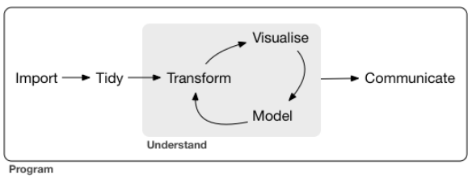

```{r setup, include=FALSE}
knitr::opts_chunk$set(echo = TRUE)
def.chunk.hook  <- knitr::knit_hooks$get("chunk")
knitr::knit_hooks$set(chunk = function(x, options) {
  x <- def.chunk.hook(x, options)
  ifelse(options$size != "normalsize", paste0("\\", options$size,"\n\n", x, "\n\n \\normalsize"), x)
})

```


# Objetivos

- Apresentar qual o entendimento que temos hoje do termo "**Ciência de Dados**" ou, como ficou mais conhecido, **Data Science** (DS), em inglês.


# O que é Ciência de Dados?


> Data science [...] allow you to turn raw data into understanding, insight, and knowledge. (@r4ds) 

\bigskip

> Data science combines multiple fields, including statistics, scientific methods, artificial intelligence (AI), and data analysis, to extract value from data [Oracle](https://www.oracle.com/data-science/what-is-data-science/).

\bigskip

>> Data science combines the scientific method, math and statistics, specialized programming, advanced analytics, AI, and even storytelling to uncover and explain the business insights buried in data [IBM](https://www.ibm.com/cloud/learn/data-science-introduction).


## Áreas multidisciplinares


{width=70%}

## Big Data


## Mundo Conectado

{width=70%}

# Linguagens de Programação em Ciência de Dados

- Dados e Escalabilidade;

\bigskip

- Em um projeto de DS temos a utilização de linguagem, ou melhor, _linguagens_ de programação;

\bigskip

- Qual á melhor linguaguem de programação? 

\bigskip

- Programação orientada à problema.

\bigskip

- R


## **Não** iremos trabalhar com:

  
  + Big Data;
  
  \bigskip
  
  + Python, Julia e outras linguagens;
  
  \bigskip
  
  + Dados não regulares (imagens, sons, textos, etc.).
  
  \bigskip

# Workflow em Ciência de Dados




##  Sistematização - Projeto em DS:


- Os verbos do DS:
  
  \bigskip
  
  1.  Coletar;
  
    \bigskip
  
  2.  Tratar;
  
    \bigskip

  3. Visualizar;
  
    \bigskip
  
  4. Modelar;

     \bigskip

  4.  Comunicar.


# R, RStudio e Repositórios

- Baixar a linguagem R - [CRAN](https://cran.r-project.org/).

\bigskip
- Baixar um "Ambiente de Desenvolvimento (IDE) - [RStudio](https://www.rstudio.com/products/rstudio/download/)

\bigskip
- Repositórios - [Github](https://github.com/)

\bigskip
- Dúvidas: [Stack Overflow](https://stackoverflow.com/)


# Referências
