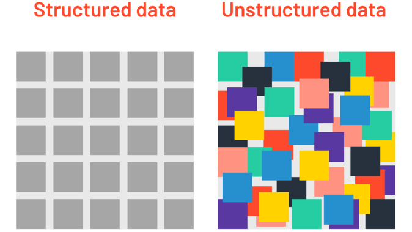

```{r setup, include=FALSE}
knitr::opts_chunk$set(echo = TRUE)
def.chunk.hook  <- knitr::knit_hooks$get("chunk")
knitr::knit_hooks$set(chunk = function(x, options) {
  x <- def.chunk.hook(x, options)
  ifelse(options$size != "normalsize", paste0("\\", options$size,"\n\n", x, "\n\n \\normalsize"), x)
})

```


# Objetivos

- Apresentar qual o entendimento que temos hoje do termo "**Ciência de Dados**" ou, como ficou mais conhecido, **Data Science**, em inglês.


## O que é Ciência de Dados?

>> Data science combines the scientific method, math and statistics, specialized programming, advanced analytics, AI, and even storytelling to uncover and explain the business insights buried in data [IBM](https://www.ibm.com/cloud/learn/data-science-introduction).
\pause

\bigskip

> Data science combines multiple fields, including statistics, scientific methods, artificial intelligence (AI), and data analysis, to extract value from data [Oracle](https://www.oracle.com/data-science/what-is-data-science/).
\pause

\bigskip
> Data science [...] allow you to turn raw data into understanding, insight, and knowled. (@r4ds) 


## O que é Ciência de Dados?


{width=70%}

## Big Data


# Workflow em Ciência de Dados


# Linguagens de Programação em Ciência de Dados

- Em todas as etapas temos a utilização linguagem, ou melhor _linguagens_, de programação;

# R, RStudio e Repositórios


# Atualizar

-   Ciência de Dados (*Data Science*);

    \bigskip

-   Conjunto de técnicas de coleta, tratamento, análise e apresetação de dados;

    \bigskip

-   Sistematização de dados em busca informações úteis.

    \bigskip

-   **melhorar apresentação inicial**

## Introdução

-   Sistematização de projeto em DS:

    \bigskip

    1.  Coleta;

        \bigskip

    2.  Tratamento;

        \bigskip

    3.  Análise;

        \bigskip

    4.  Visualização e apresentação.

## Introdução


# Coleta e Tratamento

## Coleta e Tratamento




## Coleta e Tratamento

A **coleta** dos dados podem em diferentes formatos:

\bigskip

```{=tex}
\begin{itemize}

  \item Excel;
  
  \item XML;
  
  \item JSON;
  
  \item txt;
  
  \item HTML;
  
  \item MySQL;
  
  \item Formatos proprietários (Stata, Minitab, SPSS, SAS, etc).

\end{itemize}
```

## Coleta e Tratamento

O dados precisam ser **tratamentodos**:

\bigskip

```{=tex}
\begin{itemize}

  \item Limpeza de dados; \smallskip
  
  \item Tratamento de \emph{missing values} ou NA;\smallskip
  
  \item Construção de números índices; \smallskip
  
  \item Deflacionar valores correntes; \smallskip
  
  \item Obtenção de taxas de crescimento; \smallskip
  
  \item Tratando tendências; \smallskip
  
  \item Dessazonalização; \smallskip
  
  \item Subconjuntos (\emph{subsetting}); \smallskip
  
  \item Classificação; \smallskip
  
  \item Utilização de \emph{lags}. 
  
\end{itemize}
```
# Visualização

## Visualização

Uma vez que seus dados estejam arrumados, podemos passar para a parte de **exploração dos dados**. A exploração de dados é a arte de analisar seus dados, gerando hipóteses rapidamente, testando-os rapidamente, repetindo-os várias vezes. O objetivo da exploração de dados é gerar muitos leads promissores que você poderá explorar mais tarde com mais profundidade. Em geral, faz-se exploração de dados por meio da *visualização* desses dados.

\bigskip

Um bom processo de visualização de dados permite que possamos nos concentrar naquilo que realmente importa, deixando de lado relações não tão importantes.

# Modelagem

## Modelagem

Uma vez que tenhamos conseguido propor uma *hipótese de trabalho* através da etapa de exploração/visualização de dados, o próximo passo é propor um **modelo** entre as variáveis do nosso conjunto de dados. O objetivo da modelagem é capturar a essência de um conjunto de dados.

# Comunicação

## Comunicação

A última etapa do processo de *data science* é comunicar os resultados para clientes, gestores ou demais interessados. É uma fase absolutamente crítica do projeto. Isto porque, ao menos que você consiga se comunicar com a sua audiência, de nada valeu todo o trabalho realizado nas etapas anteriores.

# O mundo *tidyverse*

## O mundo *tidyverse*

De modo a fazer cada uma dessas etapas dentro do R, nós vamos utilizar a família de pacotes `tidyverse`. Assim, antes de qualquer coisa, certifique-se que você tenha o tenha instalado na atual versão do R.

```{r code1, echo=T, eval=F, results='markup', warning=FALSE, message=FALSE, size='tiny'}

install.packages('tidyverse')
require(tidyverse)

```

## A família *tidyverse*


# Referências
