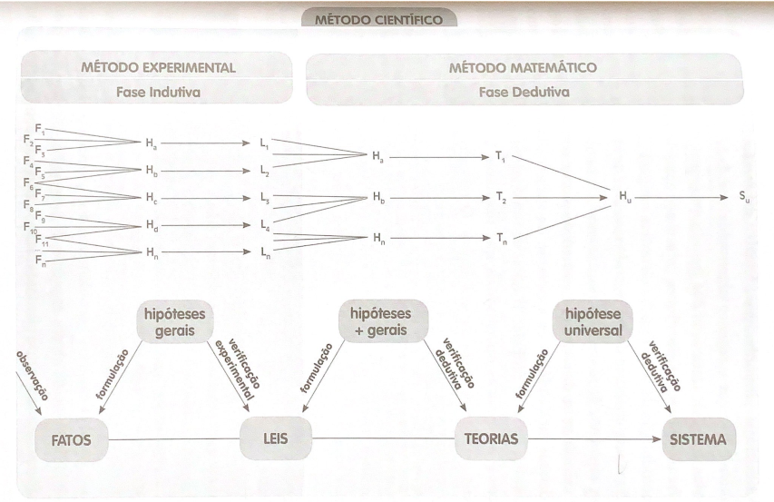
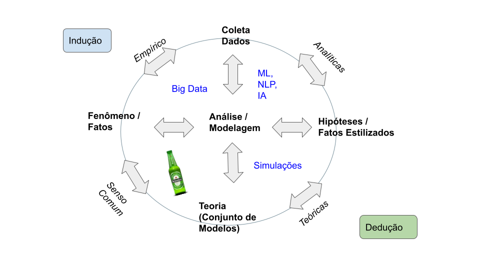
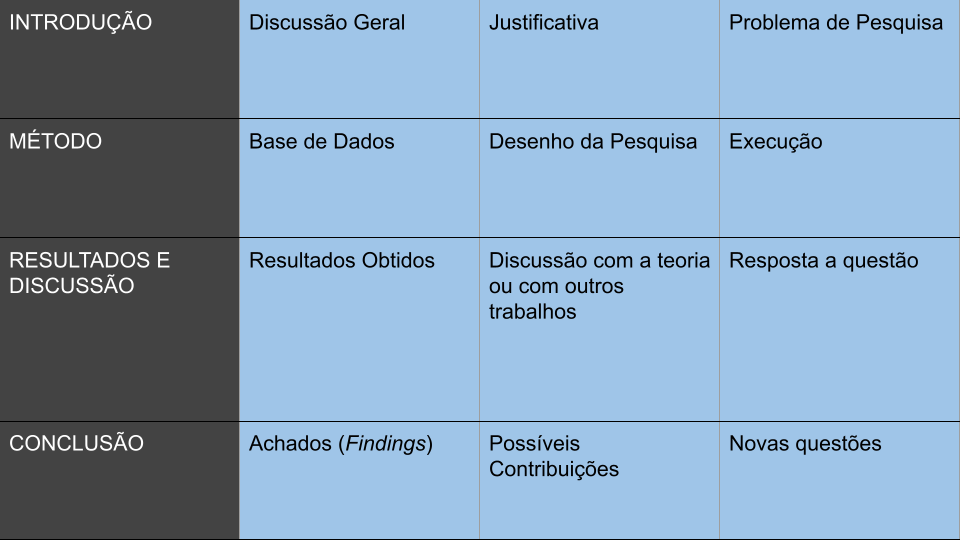
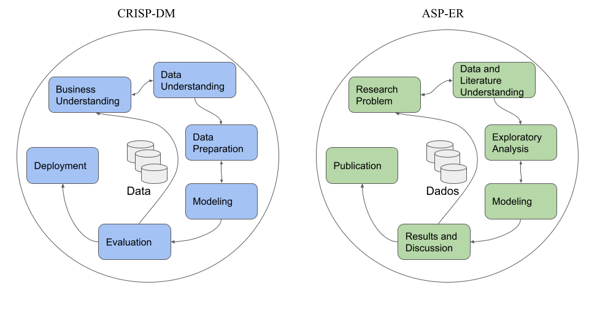

```{r setup, include=FALSE}
knitr::opts_chunk$set(echo = TRUE)
def.chunk.hook  <- knitr::knit_hooks$get("chunk")
knitr::knit_hooks$set(chunk = function(x, options) {
  x <- def.chunk.hook(x, options)
  ifelse(options$size != "normalsize", paste0("\\", options$size,"\n\n", x, "\n\n \\normalsize"), x)
})

```


# Objetivos

- Discutir o método científico e sua relação com a sistematização de um projeto de Data Science (DS), assim como, apresentar os modelos canônicos da pesquisa acadêmica, tendo como foco pesquisas que utilizam aboragens empíricas.

# Método Científico como Teória e Prática

- Ciência como prática (técnica);
\bigskip

- Ciência como método;
\bigskip

- Ciência como epistemologia.
    
\bigskip

>> "Ciência é sempre um enlace de uma malha teórica com dados empíricos, é sempre uma articulação do lógico com o real, do teórico com o empírico, do ideal com o real" @severino2017metodologia, p. 100.

## Método Científico



## Método Científico Revisitado




## Metodologias de Pesquisa Científica

**Ciência**: 

Aplica Técnicas `r "$\\rightarrow$"` Métodos `r "$\\rightarrow$"` Fundamentos Epistemológicos
\bigskip


- Modalidades de Pesquisa Acadêmicas:
  
  \bigskip
  - Pesquisa Teórica
  
  \bigskip
  - Pesquisa Teórica-Empírica


## Elementos de um Artigo Empírico




Exemplos: [Artigos 1](ArtigosExemplos/artigo1.pdf); [Revista Economia Aplicada - USP](https://www.revistas.usp.br/ecoa); [Journal of Applied Economics](https://www.tandfonline.com/toc/recs20/current)


# DS e a Pesquisa Teórica-Empírica




## Coleta e Tratamento

A **coleta** dos dados podem em diferentes formatos:

\bigskip

```{=tex}
\begin{itemize}

  \item Excel;
  
  \item XML;
  
  \item JSON;
  
  \item txt;
  
  \item HTML;
  
  \item MySQL;
  
  \item Formatos proprietários (Stata, Minitab, SPSS, SAS, etc).

\end{itemize}
```

## Coleta e Tratamento

O dados precisam ser **tratamentodos**:

\bigskip

```{=tex}
\begin{itemize}

  \item Limpeza de dados; \smallskip
  
  \item Tratamento de \emph{missing values} ou NA;\smallskip
  
  \item Construção de números índices; \smallskip
  
  \item Deflacionar valores correntes; \smallskip
  
  \item Obtenção de taxas de crescimento; \smallskip
  
  \item Tratando tendências; \smallskip
  
  \item Dessazonalização; \smallskip
  
  \item Subconjuntos (\emph{subsetting}); \smallskip
  
  \item Classificação; \smallskip
  
  \item Utilização de \emph{lags}. 
  
\end{itemize}
```


## Visualização


```{r Plot1, echo=FALSE, message=FALSE, warning=FALSE}
# Bibliotecas
library(tidyverse)

# Primeiro Gráfico
ggplot(mtcars) +
  geom_point(aes(x = hp, y = mpg)) +
  labs(title = 'Relação entre consumo e potência',
       y = 'Consumo',
       x = 'Potência') + 
   theme_bw()

```

## Visualização

```{r Plot1-melhorado, echo=FALSE, message=FALSE, warning=FALSE}
# Bibliotecas
library(tidyverse)

# Primeiro Gráfico
ggplot(mtcars) +
  geom_point(aes(x = hp, y = mpg, color = factor(am)),
             size = 3) +
  scale_color_manual("Automático",
                     values = c("red", "blue"),
                     labels = c("Não", "Sim")) +
  labs(title = 'Relação entre consumo, potência por tipo de câmbio',
       y = 'Consumo',
       x = 'Potência')+
  theme_classic()
  #theme_minimal()
```


## Modelagem

MQO:
$$
y_i = \beta_{1}x_{1i} + \beta_{2}x_{2i} + \dots + \beta_{k}x_{ki} + \epsilon_i, i = 1, \dots N.
$$


```{r echo=FALSE, resize.width=0.5, results= 'asis'}
data(mtcars)
resultado <- lm(mpg ~ hp, data = mtcars)

resultado1 <- lm(mpg ~ hp, data = mtcars, subset = (am == 0))

resultado2 <- lm(mpg ~ hp, data = mtcars, subset = (am == 1))

stargazer::stargazer(resultado,resultado1, resultado2, title = "Regressão por MQO", 
                     header = FALSE,
                     font.size = "tiny")

#stargazer::stargazer(resultado,  ci=TRUE, type = "text",no.space = TRUE, 
#                     title = "Tabela 1",
#                     header = FALSE,
#                     #single.row = TRUE,
#                     column.sep.width = "1pt",
#                     font.size = "tiny")


```


É possível escrever dentro do texto utilizando marcação do R, como o seguinte exemplo: `r round(resultado$coefficients[1], 3)`, o intercepto para `r resultado1$coefficients[1]` e do `r resultado2$coefficients[1]`.


## Rmarkdown

- Literate Programs - LitPro;

- [Exemplo](LitarateProgramming/2.Rmarkdown_paper_example.pdf)

# O mundo *tidyverse*

## O mundo *tidyverse*

- Todas as etapas podem ser desenvolvidas em um único ambiente (RStudio);

\bigskip

- Bibliotecas, bibliotecas e seus próprios pacotes.

```{r code1, echo=T, eval=F, results='markup', warning=FALSE, message=FALSE, size='tiny'}

install.packages('tidyverse')
library(tidyverse)

```

## O mundo *tidyverse*


# Referências
