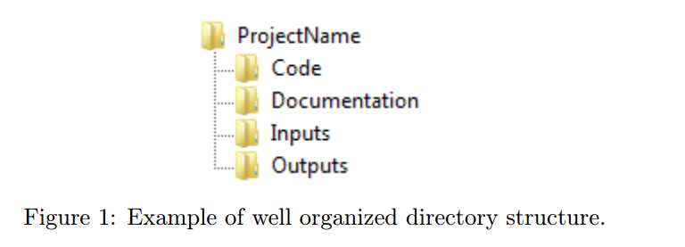

```{r setup, include=FALSE}
knitr::opts_chunk$set(echo = TRUE)
def.chunk.hook  <- knitr::knit_hooks$get("chunk")
knitr::knit_hooks$set(chunk = function(x, options) {
  x <- def.chunk.hook(x, options)
  ifelse(options$size != "normalsize", paste0("\\", options$size,"\n\n", x, "\n\n \\normalsize"), x)
})

```


# Literate Programming - LitPro

- Código mais texto.
\bigskip

- Boas práticas (Reproducible Research)
\bigskip


- Rmarkdown


# How to make a pie?

- HOW TO MAKE A PIE: REPRODUCIBLE RESEARCH FOR EMPIRICAL ECONOMICS AND ECONOMETRICS (@orozco2020make)
\bigskip

- Princípios:
    1. Organize your work
    2. Code for others (including your future self)
    3. Automate as much as you can

## Organize your work

- Organização de tarefas e documentação;

- Organização de arquivos:
  

- Backup, backup, backup.

## Code for others (including your future self)

- Utilize um código limpo;
\bigskip

- Comente, comente e documente;
\bigskip

- DRY (Don’t Repeat Yourself).
\bigskip

## Automate as much as you can

- Codifique tudo;
\bigskip

- Exporte resultados (Nada de copy & paste);
\bigskip

- Link tudo;
\bigskip

- Crie documentos reprodutíveis.
\bigskip


# RMarkdown

- Linguagem de marcação;
\bigskip

- RStudio
```{r eval=FALSE}
#  install.packages('tinytex')
#  tinytex::install_tinytex()  
```

- Produção de manuscritos acadêmico

- Markdown references:

    -   [Markdown Guide](https://www.markdownguide.org/)

    -   [R Markdown - Get Started](https://rmarkdown.rstudio.com/lesson-1.html)

    -   [R Rarkdown: The definitive guide](https://bookdown.org/yihui/rmarkdown/)


# Referências
